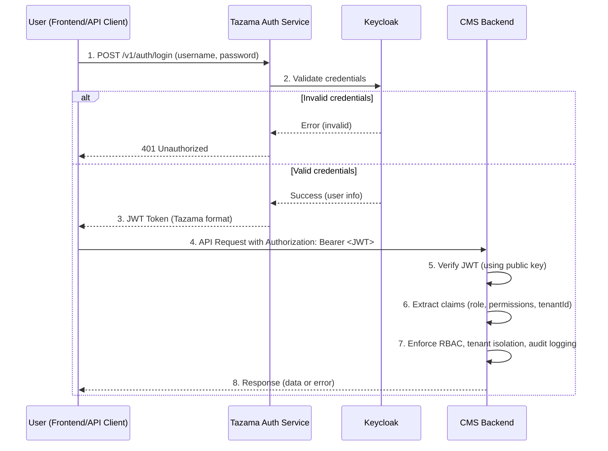

# Fullstack App

Fullstack App is a comprehensive solution for managing cases and investigations efficiently. This project aims to streamline workflows, improve collaboration, and provide robust tools for tracking, reporting, and analyzing case data.

---

## Table of Contents

- [1. Component Overview](#1-component-overview)
- [2. System Architecture](#2-system-architecture)
  - [2.1 Authentication Flow](#21-authentication-flow)
- [3. Configuration](#3-configuration)
- [5. Running the Service](#5-running-the-service)
- [6. Testing](#6-testing)
- [7. Coding Standards](#7-coding-standards)
- [8. Troubleshooting](#8-troubleshooting)
- [9. Security](#9-security)

---

## **_1. Component Overview_**

This is a NestJS + TypeScript service for managing financial crime cases and investigations. It includes modules for triage, alert-to-case conversion, tasking, evidence, reporting, auditing, and authentication/authorization (Keycloak via Tazama Auth Service). It uses PostgreSQL via Prisma and supports multi-tenant RBAC.

---

## **_2. System Architecture_**

### **2.1 Authentication Flow**

## Table of Contents

- [1. Component Overview](#1-component-overview)
- [2. System Architecture](#2-system-architecture)
  - [2.1 Authentication Flow](#21-authentication-flow)
- [3. Configuration](#3-configuration)
- [5. Running the Service](#5-running-the-service)
- [6. Testing](#6-testing)
- [7. Coding Standards](#7-coding-standards)
- [8. Troubleshooting](#8-troubleshooting)
- [9. Security](#9-security)

---

## **_1. Component Overview_**

This is a NestJS + TypeScript service for managing financial crime cases and investigations. It includes modules for triage, alert-to-case conversion, tasking, evidence, reporting, auditing, and authentication/authorization (Keycloak via Tazama Auth Service). It uses PostgreSQL via Prisma and supports multi-tenant RBAC.

---

## **_2. System Architecture_**

### **2.1 Authentication Flow**

# Tazama Case Management System – Authentication Flow

## Overview

This project uses a secure, centralized authentication flow leveraging Keycloak, the Tazama Auth Service, and JWT-based authorization in the CMS backend.  
Below is a sequence diagram and explanation of how authentication and authorization work in this system.

---

## Authentication Sequence Diagram



## **_3. Configuration_**

Application settings are configured primarily via environment variables. See `.env.template` for required values. Key areas:

- Database: Prisma/PostgreSQL connection
- Auth: Keycloak/Tazama Auth Service JWT verification
- NATS (if used): messaging settings
- Logging and audit configuration

---

---

## **_4. Running the Service_**

### Project setup


## **_3. Configuration_**

Application settings are configured primarily via environment variables. See `.env.template` for required values. Key areas:

- Database: Prisma/PostgreSQL connection
- Auth: Keycloak/Tazama Auth Service JWT verification
- NATS (if used): messaging settings
- Logging and audit configuration

## Project setup

---

## **_4. Running the Service_**

### Project setup

## **_3. Configuration_**

Application settings are configured primarily via environment variables. See `.env.template` for required values. Key areas:

- Database: Prisma/PostgreSQL connection
- Auth: Keycloak/Tazama Auth Service JWT verification
- NATS (if used): messaging settings
- Logging and audit configuration

---

---

## **_4. Running the Service_**

### Project setup

```bash
$ npm install
```

### Compile and run the project


```bash
# development


############prisma
# Install Prisma and Client
$ npm install prisma --save-dev
$ npm install @prisma/client

# Initialize Prisma
$ npx prisma init

# After editing schema.prisma → Create migration
$ npx prisma migrate dev --name init

# Push schema to DB without migration history (optional)
$ npx prisma db push

# Generate Prisma Client (run after every schema change)
$ npx prisma generate

$ npm run start

# watch mode
$ npm run start:dev

# production mode
$ npm run start:prod
```

---

## **_5. Testing_**

## Run tests

## **_5. Testing_**

---

## **_5. Testing_**

```bash
# unit tests
$ npm run test

# e2e tests
$ npm run test:e2e

# test coverage
$ npm run test:cov
```

---

## **_6. Coding Standards_**

This project follows Tazama code standards and conventions. Use the Event Director repository (`frmscoe/event-director`) as the reference for configuration and practices (ESLint, Prettier, Jest, `tsconfig`, `.gitignore`). Keep your changes consistent with those patterns.

Key tools:

- ESLint for linting
- Prettier for formatting
- Jest for testing

### Linting

### Run lint

Checks your code for style and type issues using ESLint:

```bash
npm run lint
```

### Auto-fix lint errors

Automatically fixes fixable lint and formatting issues:

```bash
npm run lint -- --fix
```

### Formatting

### Format code with Prettier (entire workspace)

```bash
npx prettier --write .
```

### Format only TypeScript in `src/` and `test/`

```bash
npx prettier --write "src/**/*.ts" "test/**/*.ts"
```

### Format coverage output (optional)

```bash
npx prettier --write "coverage/**/*.*"
```

### Testing

### Run all testsgit push

Runs unit and integration tests using Jest:

```bash
npm test
```

Or, equivalently:

```bash
npm run test
```

For e2e tests and coverage, you can also use the existing scripts:

```bash
npm run test:e2e
npm run test:cov
```

### Notes

- Fix all lint and formatting errors before committing code.
- If you add new dependencies or scripts, update this README accordingly.
- For environment setup, see `.env.template`.

---

## **_7. Troubleshooting_**

If you see many TypeScript warnings about `any` usage, add proper types. If Prettier or ESLint behave unexpectedly, check your configuration files (e.g., `eslint.config.mjs`, `.prettierrc`).

---

## **_8. Security_**

- Never commit your `.env` file or secrets to version control.
- Always review code for security best practices before deploying.

---

# case-management-system

Tazama Case and Investigation Management System

## Deployment

## **_6. Coding Standards_**

This project follows Tazama code standards and conventions. Use the Event Director repository (`frmscoe/event-director`) as the reference for configuration and practices (ESLint, Prettier, Jest, `tsconfig`, `.gitignore`). Keep your changes consistent with those patterns.

Key tools:

- ESLint for linting
- Prettier for formatting
- Jest for testing

### Linting

### Run lint

Checks your code for style and type issues using ESLint:

```bash
npm run lint
```

### Auto-fix lint errors

Automatically fixes fixable lint and formatting issues:

```bash
npm run lint -- --fix
```

### Formatting

### Format code with Prettier (entire workspace)

```bash
npx prettier --write .
```

### Format only TypeScript in `src/` and `test/`

```bash
npx prettier --write "src/**/*.ts" "test/**/*.ts"
```

### Format coverage output (optional)

```bash
npx prettier --write "coverage/**/*.*"
```

### Testing

### Run all testsgit push

Runs unit and integration tests using Jest:

```bash
npm test
```

Or, equivalently:

```bash
npm run test
```

## For e2e tests and coverage, you can also use the existing scripts:

## **_6. Coding Standards_**

This project follows Tazama code standards and conventions. Use the Event Director repository (`frmscoe/event-director`) as the reference for configuration and practices (ESLint, Prettier, Jest, `tsconfig`, `.gitignore`). Keep your changes consistent with those patterns.

Key tools:

- ESLint for linting
- Prettier for formatting
- Jest for testing

### Linting

### Run lint

Checks your code for style and type issues using ESLint:

```bash
npm run lint
```

### Auto-fix lint errors

Automatically fixes fixable lint and formatting issues:

```bash
npm run lint -- --fix
```

### Formatting

### Format code with Prettier (entire workspace)

```bash
npx prettier --write .
```

### Format only TypeScript in `src/` and `test/`

```bash
npx prettier --write "src/**/*.ts" "test/**/*.ts"
```

### Format coverage output (optional)

```bash
npx prettier --write "coverage/**/*.*"
```

### Testing

### Run all testsgit push

Runs unit and integration tests using Jest:

```bash
npm test
```

Or, equivalently:

```bash
npm run test:e2e
npm run test:cov
```

### Notes

- Fix all lint and formatting errors before committing code.
- If you add new dependencies or scripts, update this README accordingly.
- For environment setup, see `.env.template`.

---

## **_7. Troubleshooting_**

If you see many TypeScript warnings about `any` usage, add proper types. If Prettier or ESLint behave unexpectedly, check your configuration files (e.g., `eslint.config.mjs`, `.prettierrc`).

---

## **_8. Security_**

- Never commit your `.env` file or secrets to version control.
- Always review code for security best practices before deploying.

---

Nest is [MIT licensed](https://github.com/nestjs/nest/blob/master/LICENSE).
npm run test

````

For e2e tests and coverage, you can also use the existing scripts:

```bash
npm run test:e2e
npm run test:cov
````

### Notes

- Fix all lint and formatting errors before committing code.
- If you add new dependencies or scripts, update this README accordingly.
- For environment setup, see `.env.template`.

---

## **_7. Troubleshooting_**

If you see many TypeScript warnings about `any` usage, add proper types. If Prettier or ESLint behave unexpectedly, check your configuration files (e.g., `eslint.config.mjs`, `.prettierrc`).

---

## **_8. Security_**

- Never commit your `.env` file or secrets to version control.
- Always review code for security best practices before deploying.

---
